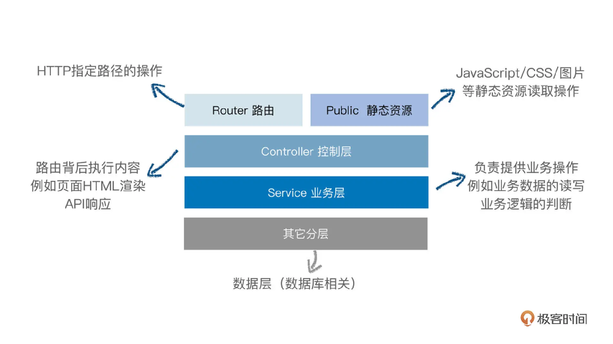

```
# packages/work-server/src
.
├── controller/*
├── public/*
├── service/*
├── template/*
├── util/*
├── router.ts
└── index.ts
```

- 文件 router.ts，是路由层 ，定义 Web 服务的 URL 内容；
- 目录 controller，是控制层，控制页面内容和 API 内容的 HTTP 响应；
- 目录 service，是业务层，提供一些业务逻辑的操作；
- 目录 public，是静态资源目录，存放 JavaScript、CSS 和图片等静态资源。

